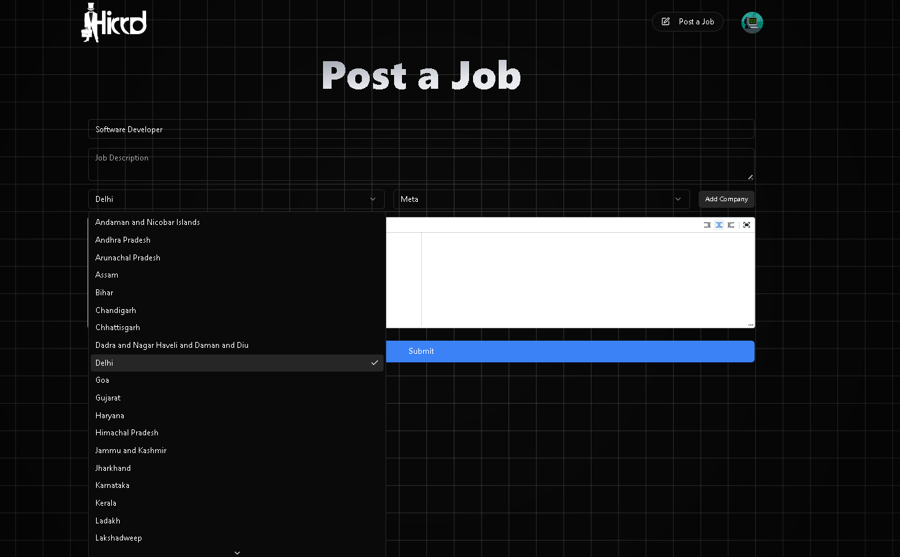
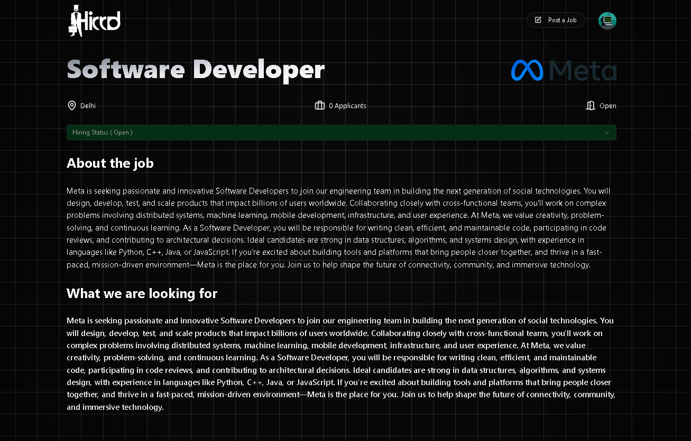

# 🎬 Hierr Production

A modern media and video production showcase platform built with **React**, **Vite**, and **Tailwind CSS**, deployed via Vercel. Designed for clean visuals, fast performance, and production-ready workflows.

---

## 📸 Screenshots

### 🎥 Home


### 🎥 Home


### 🎥 Home


### 📹 JOb Page (Job Seeker)


### 📹 JOb Details Page


### 📹 Post Job Page (Recruiter)



### 📹 Post Job Details Page



---

## 🚀 Features

- 🎬 Vite-powered React frontend with HMR & fast builds
- ⚡ Tailwind CSS for utility-first responsive design
- 🌐 Mobile-first layout with smooth transitions
- 🎥 Video gallery with play overlays/modals
- 🏗️ ESLint + Prettier for consistent code style
- 🔧 Easily deployable via Vercel

---

## 🛠️ Tech Stack

| Technology        | Purpose                      |
| ----------------- | ---------------------------- |
| Vite + React      | Frontend framework & bundler |
| Tailwind CSS      | Styling and responsiveness   |
| ESLint + Prettier | Code linting & formatting    |
| Vercel            | Continuous deployment        |

---

## 📦 Installation & Setup

1. **Clone the repo**

   ```bash
   git clone https://github.com/AgrawalSujal/Hierr-Production.git
   cd Hierr-Production
   ```

2. **Install dependencies**

   ```bash
   npm install
   ```

3. **Run development server**

   ```bash
   npm run dev
   ```

4. **Live preview**

   ```bash
   Visit http://localhost:5173 in your browser
   ```

## ⚙️ Deployment

- This project is ready for deployment on Vercel:
- Create a new Vercel project and select this repo
- It auto-detects Vite — defaults are preconfigured
- Deploy your app — it’s live immediately!

## 🧹 Repository Structure

```bash
Hierr-Production/
├── public/            # Static assets (images, icons, videos)
├── src/
│   ├── components/    # Reusable UI elements
│   ├── assets/        # Media files for production
│   ├── App.jsx        # Main App with routes
│   ├── main.jsx       # Entry point
│   └── index.css      # Global styles/imports
├── .gitignore
├── postcss.config.js
├── tailwind.config.js
├── vite.config.js
└── README.md

```

## 💡 Contributing

- Contributions are welcome! To report bugs or request features, please open an issue. If you’d like to contribute:
- Fork the repo
- Create your feature branch (git checkout -b feature/my-feature)
- Commit your changes (git commit -m 'Add feature')
- Push (git push origin feature/my-feature)
- Create a Pull Request

👨‍💻 Author
Sujal Agrawal
🚀 Passionate full-stack developer crafting modern web apps with React, Node.js, and clean UX design.
